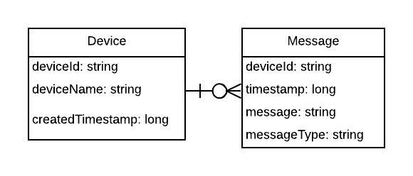

# AWS AppSync GraphQL API

This repo contains an example implementation of a GraphQL API for an IoT Device Messaging System. It is 
built with [AWS Appsync](https://aws.amazon.com/appsync/) and using Typescript lambda functions as resolvers and DynamoDB as a data source. 

The models exposed via the API are Devices and Messages:



An example use case for the API would be an admin console for managing IoT Devices and viewing messages. The API could
be expanded upon to provide realtime message updates for Devices using Appsync/GraphQL subscriptions.

## Requirements

* AWS CLI already configured with Administrator permission
* [nodejs10.x installed](https://nodejs.org/en/download/releases/)
* [Docker installed](https://www.docker.com/community-edition)
* Typescript installed

## Testing

The GraphQL lambdas can be tested locally using the [Amazon DynamoDB docker image](https://hub.docker.com/r/amazon/dynamodb-local).

To execute unit tests, run:
```bash
export DEVICES_DYNAMODB_TABLE=TestDevicesTable
export MESSAGES_DYNAMODB_TABLE=TestMessagesTable
make test
```

This will:
- Set the table name env var available to Jest  
- Launch the dynamodb docker image in a separate process with `port 8000` mapped  
- Execute unit tests. Before tests execute a dynamodb table is created in the docker image  
- Stops and removes the dynamodb image after test execution  

## Packaging and deployment

An S3 bucket must be created before deployment to hold the lambda code:

```
aws s3 mb s3://BUCKET_NAME
```

Set the follow environment variables:
```bash
export S3_BUCKET=
export STACK_NAME=
```

```bash
# Build and test during development
make

# Build, Package and Deploy
make deploy-stack
```

Individual lambda functions can be tested using the SAM CLI:
```
# Updates the handler.zip lambda package that SAM references
make local-package

sam local invoke <LAMBDA_FUNCTION_NAME>
```

#### Packaging notes:
- The `devDependencies` are installed in order for `tsc` to compile the TypeScript code to Javascript
- The dev `node_modules` are then removed and the production dependencies are installed and zipped in the lambda package

## Integration Tests

Integration tests can be executed against the live Appsync API. The tests use `graphql-request` and `jest` to 
execute server-side GraphQL queries against Appsync. These could be used to test an Appsync API after deployment as the
final stage of a pipeline.

The tests are dependent on the APPSYNC URL and API KEY being available as Environment variables.

Also note, the tests currently require data to be populated in DynamoDB before running. 
They could be extended to add mutations that are then validated by queries to ensure that they 
do not rely on previous DynamoDB state.

```
export APPSYNC_ENDPOINT_URL=
export APPSYNC_API_KEY=

make integration-test
```


## Example Queries

```graphql
mutation {
      storeMessage(
        deviceId: "D123", 
        message: "An anomaly was detected",
        messageType: "Alert"
      ) {
    deviceId,
    timestamp
  }
}

Returns:
{
  "data": {
    "storeMessage": {
      "deviceId": "D123",
      "timestamp": 1558052249959,
    }
  }
}

query {
  getMessage(deviceId: "D123", timestamp: 1558052249959) {
   message,
   messageType
  }
}

# See all messages for the device
query {
  allMessages(deviceId: "D123") {
   message
  }
}

Returns:
{
  "data": {
    "allMessages": [
      {
        "message": "An anomaly was detected"
      },
      {
        "message": "Everything is fine"
      }
    ]
  }
}

# See all messages for the device
query {
  getDevice(deviceId: "D123") {
    deviceName,
    messages {
      timestamp,
      message
    }
  }
}
```

## AppSync notes

- When a nested resolver is called, like the `messages` field on `Device`, the `ctx.source` object contains a JSON 
object of the resolved fields from the parent object. If a nested resolver is called but no other fields on the parent 
type are queried, the parent type still must be resolved:
```graphql
query {
    getDevice(deviceId: "D123") {
        messages {
            message
        }
    }
}

GetDeviceQueryResolver (Pipeline resolver)
    - GetUserLambdaFunction called
    - GetDeviceLambdaFunction called (receives user from ctx.stash)
GetDeviceQueryResolver (Unit resolver)
    - AllMessagesLambdaFunction called (receives resolved Device properties from ctx.source)
```

- If a field with a nested resolver is not queried, the nested resolver will *NOT* be called, for example the following 
query does not require the resolver on the `messages` field to be called:
```graphql
query {
    getDevice(deviceId: "D123") {
        deviceName
    }
}

GetDeviceQueryResolver (Pipeline resolver)
    - GetUserLambdaFunction called
    - GetDeviceLambdaFunction called (receives user from ctx.stash)
```

- If you Reject a promise or throw an uncaught exception in a nested resolver the field will return `null` and the 
AppSync resulting errors object will contain the error reason/message.
```graphql
query {
    getDevice(deviceId: "D123") {
        deviceName,
        messages {
            message
        }
    }
}

{
  "data": {
    "getDevice": {
      "deviceName": "IoTDevice",
      "messages": null
    }
  },
  "errors": []
}
```
